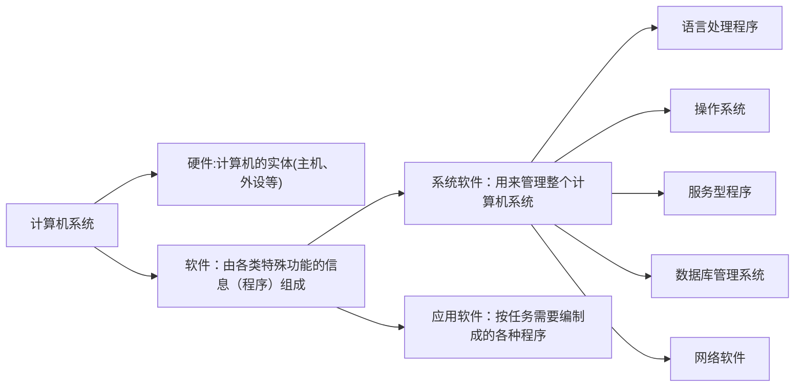
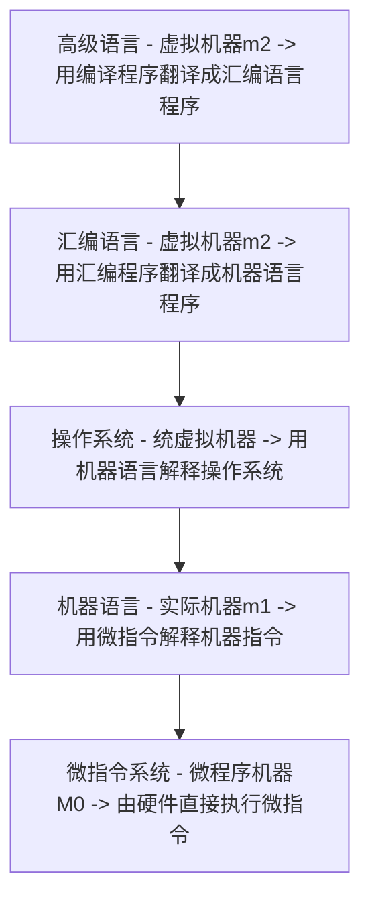

## 计算机组成

***

### 计算机层次结构

- 硬件提供指令接口
- 软件根据硬件提供的指令接口编写程序
  - 系统软件管理硬件资源，并为应用软件提供接口
  - 应用利用系统接口实现应用程序功能

### 计算机的基本组成

#### 冯诺依曼结构

- 运算器（核心）：算数运算和逻辑运算
- 存储器：存放数据和程序
- 控制器 ：指挥控制程序的运行，完成一条指令的执行，完成指令之间的先后顺序
- 输入设备：将信息转换为机器能识别的形式
- 输出设备：将计算机处理结构转换成人所熟悉的形式

以运算器为中心，会成为整个结构的瓶颈

#### 现代计算机结构

##### 存储器的基本组成

- 存储体：由若干**存储单元**组成，存储单元包含若干**存储元件**（0/1）

  - 存储单元：存放一串二进制代码，

  - 存储字：存储单元总二进制代码的组合

  - 存储字长：存储字的长度，存储单元中二进制代码的位数

    每个存储单元赋予一个地址，存放一个存储字，按地址访问

- MAR（**M**emory **A**ddress **R**egister）：存储器地址存储器，保存了存储单元的地址或者是编号，反应存储单元的个数

  假设MAR=4位，则表示16个地址

- MDR**M**emory **D**ata **R**egister：存储器数据寄存器，保存了要送入CPU中的数据、保存了要保存到存储体中的数据或者刚刚从存储体中取出来的数据，反映存储字长

  假设MDR=8位，则表示存储字长为8位

  

##### 运算器基本结构

- ACC
- ALU
- MQ
- X

##### 控制器结构

控制器：解释指令；保证指令的顺序执行

- PC：保存当前前要执行指令的地址
- IR：指令寄存器，存放当前要执行的指令和操作数地址
- CU：发放控制信号

完成一条指令的过程：

##### 主机完成一条指令的过程

要执行的一条指令地址是保存在PC中的，指令是保存在存储体中的

- 取指令过程

   1. PC将指令地址送给MAR
   2. MAR送给存储体
   3. 在控制器控制下，存储体将指定存储单元保存的存储取数指令取出，送入MDR中
   4. MDR将取数指令发送给IR，IR是保存当前要执行的指令

- 分析指令过程：

   5. 将指令寄存器IR中的操作码送给CU进行译码，由CU发出控制信号，由相应的控制部件执行指令要求的各种操作

- 执行指令过程

   6. 由控制器控制，从IR中将地址取出送入MAR（IR中保存了当前指令和操作数地址）
   7. MAR将地址送入存储体
   8. 在控制器的控制下由取数指令将要取的数取出，送入MDR
   9. MDR将取出的数存入ACC

存数指令过程：

#### 系统复杂性管理的方法

- 层次化：将被设计的系统划分为多个模块或子模块化
- 模块化：有明确定义的功能和接口
- 规则性：模块更容易被重用，符合工业化或者国际化，具有标准化

## 系统总线

***

### 基本概念

总线是连接各个部件的信息传输线，是各个部件**共享的传输介质**，同一时刻只能由一对设备使用总线

传输方式

- 串行：要传输的数据一位一位的放在总线上，接收方再一位一位的接收
- 并行：要传输的数据多位同时放在总线上，接收方也同时接收多位数据，需要多条数据线进行传输，传输距离长时，由于并行会产生干扰，传输的信号会发生变形，接收方很难接收到正确的数据。

### 总线结构 

#### 1、单总线结构

单总线结构简单，但是同一时刻只有一对设备能使用总线，会发生设备的争用

#### 2、面向CPU的双总线结构

当需要和外部进行数据交互时，CPU计算任务还是会被打断

 

#### 3、以存储器为中心的双总线结构

 CPU和主存有专用存储总线，如果主存要和外部设备或者I/O设备进行信息交换可以通过系统总线，但是以目前的技术还是通过分时进行的。

 

#### 4、以通道为连接的双总线结构

通道时具有特殊功能的处理器，由通道对I/O统一管理，专门用于输入输出操作，有自己的处理器、指令系统，能够执行一些简单的指令

#### 5、增加DNA的三总线结构

#### 6、增加局部总线的三总线结构

7、增加Cache的四总线结构

将高速设备和低速设备分开

### 总线分类

控制总线：向系统的各个部件传输控制信号，或者系统各个部件的状态信号向外传输告诉主件或者CPU，这个方向时双向的

- 存储器读、存储器写、总线允许、中断确认
- 中断请求、总线请求

**通信总线**：用于计算机系统之间或计算机系统与其他系统（如控制仪表、移动通信等）之间的通信。

### 总线的实现

### 总线特性

### 总线控制

#### 总线判优控制

- 主设备：对总线具有控制权，可以提出对总线的占有申请
- 从设备：只能相应从主设备发来的总线命令

#### 总线通信控制

结局通信双方协调配合问题

**总线传输周期**

**通信方式**

**半同步通信**

**分离式通信**

## 存储器

### 分类

**按照存取方式分类**

**按照作用分类**

ROM（Read Only Memory）：只读存储器，再厂家生产时就编译好了，目前是可以进行多次写（）。

### 层次结构

### 主存储器

#### 基本组成

#### 主存和CPU联系

#### 主存中存储单元地址的分配

### 高速缓冲存储器

***

由于CPU和主存（DRAM）的速度差异，避免CPU“空等”现象

Cache基本机构：

#### 命中和未命中

缓存共有C块，主存共有M块，主存容量远大于缓存，$M >> C$

- 命中：再CPU访问主存时，如果要访问的块已经放到了缓存中，能再缓存中取到相应的数据、指令，则称为命中。
- 未命中：如果CPU访问主存，在缓存中不能取到相应的数据，需要到主存中获取。

命中率：CPU欲访问的信息在Cache中比率，使用命中率作为评价指标

#### Cache读写操作

#### Cache-主存地址映射

##### 1、直接映射

主存当中任意一个给定的一个块只能映射（装载到）某一个指定的Cache块中。

以Cache为刻度，将主存划分为相同的大小的区域，每个区域包含和Cache相同的字块数。

主存中第i块区域的第j块只能放在Cache中第j块区域（j从0开始），即Cache中第j块存储的是主存中第i区的第j块

**特点：**速度快，不灵活，Cache的利用率低

 

##### 2、全相联映射

主存储器中的块可以放入Cache中的任意位置。

**特点：**成本高，速度满，Cache利用率高

##### 3、组相联映射

把Cache分成Q组，每组大小为$2^k$，主存器中的子块分区，每个区的大小和Cache组数相同，即每个区中块数和Cache中的组数相同。每个区的第0块可以放入Cache中第0组的任意位置。

**特点：**速度块，Cache利用率比较高

#### Cache替换算法

希望替换的是CPU之后不再使用，或者很长时间才会使用的，体现程序的局部性原理

##### 1、先进先出（FIFO）算法

##### 2、近期最少使用（LRU）算法

## 输入输出设备

***

### IO设备与主机信息传送控制方式

***

#### 1、程序查询方式

- CPU执行现行程序，遇到I/O操作后启动I/O操作
- CPU对设备状态和接口状态进行查询，一直查询到数据准备好，并完成传输
- 传输完成后，CPU继续执行原来的程序

查询阶段：大部分时间CPU在进行查询等待，外部设备在做准备

#### 2、程序中断方式

将CPU逐渐从传输工作中独立出来，加强IO设备的自治能力

- CPU执行现行程序，直到启动IO的指令
- CPU发出启动IO指令，发出启动IO指令后，继续执行现行程序
- 外部设备开始IO准备，准备完成后，会向CPU发送一个中断请求
- CPU接收到中断请求，会执行中断服务程序，执行完后继续执行现行程序

在IO准备阶段，IO设备和CPU是并行的

#### 3、DMA方式

- CPU执行现行程序，直到启动IO的指令
- CPU发出启动IO指令，发出启动IO指令后，继续执行现行程序
- 外部设备开始IO准备，准备完成后，会窃取一个（或者几个）存取周期，在这些存储周期中，外部设备和内存在DMA控制器控制下完成一或者几个字的信息交换
- 交换结束后，CPU继续执行现行程序

在数据交换期间，任然可以继续运行，只是不能访问内存，但是不需要进行保护现场和恢复现场，不需要中断程序，也不需要通过软件控制输入输出的操作。

### I/O设备

### I/O接口

- 实现设备的选
- 实现数据缓冲达到速度匹配
- 实现数据串- 格式转换
- 实现电平转换
- 传送控制命令
- 反应设备状态（忙、就绪等）

## 指令系统

### 寻址方式

确定本条指令的**操作数地址**，或下一条要执行**指令的地址**

#### 1、顺序寻址

取完一条指令后，顺序取下一条指令，由于指令是保存在PC中的，为了取下一条指令，取完当前指令，会将PC的内容加上1存入PC中，$PC = PC + 1$

#### 2、数据寻址

寻址方式就是通过形式地址找到有效地址

**立即寻址方式**

形式地址给出的就是操作数

立即寻址方式表示操作数已经被取到CPU中，不需要再访存

**直接寻址方式**

有效地址就等于形式地址，直接给出的就是物理地址

**隐含寻址方式**

操作数地址隐含再操作码中，或参与运算的某一个数据所在的位置由操作码给出

**间接寻址方式**

指操作数的地址保存再某个存储单元中（有效地址是在内存单元中保存），指令中保存的是存储单元的地址

**寄存器寻址方式**

有效地址就是寄存器编号

**寄存器间接寻址**

操作数保存在内存单元中，操作数的地址保存在寄存器中

**基址寻址方式**

- 专用寄存器作为基址寄存器：在CPU中设置专用的寄存器作为基址寄存器，有效地址是基址寄存器保存的内容加上形式地址

- 通用寄存器作为基址寄存器：

**变址寻址方式**

指定一个变址寄存器，有效地址是变址寄存器的内容加上形式地址

在数组上，A作为起始地址，IX可以作为数组的下标

**相对寻址方式**

相对当前的PC值，有效地址是PC内容加上形式地址

**堆栈寻址方式**

一个先进后出的队列

## CPU的结构和功能

***

### CPU的功能

大致功能为：指令控制、操作控制、时间控制、时间控制、数据加工、数据中断。

***

#### 1、控制器功能

- 取指令
- 分析指令
- 执行指令，发出各种操作指令
- 控制程序输入结果的输出
- 总线管理
- 处理异常情况和特殊情况

#### 2、运算器功能

- 实现算数运算和逻辑运算

### CPU的结构

***

#### CPU结构框图

**CPU与总线**

## 指令周期

***

指令周期：取出并执行（解释）一条指令所需要的全部时间

## 指令流水

***

1、**吞吐率**：单位时间内流水线所完成指令或输出结果的数量

设$m​$段流水线各段时间为$\Delta t​$

**最大吞吐率** $T_{pmax} = 1 / \Delta t$

实际吞吐率：连续处理$n$条指令的吞吐率
$$
T_p = \frac{n}{m.\Delta t + (n - 1).\Delta t}
$$

2、**加速比**：$m$段的流水线的速度与等功能的非流水线的速度之比

设流水线各段时间为$\Delta t$

完成$n$条指令在$m$段流水线上共需
$$
T = m.\Delta t + (n - 1).\Delta t
$$
完成$n$条指令在等效的非流水线上共需
$$
T^` = nm.\Delta t
$$
则加速比 $S_p = \frac{nm.\Delta t}{m.\Delta t + (n - 1).\Delta t} = \frac{nm}{m + n - 1}$

3、**效率**：流水线中各功能段的利用率
$$
效率 = \frac{流水线上各段处于工作时间的时空区}{流水线中各段总的时空区} = \frac{mn.\Delta t}{m(m + n - 1).\Delta t}
$$

### 嵌入式流水线

在典型的五级流水线的嵌入式处理器设计中(如ARM9)，其过程包括取指、译码、执行、访存和回写五个步骤。

- **取指**是指从存储器中取出指令，并将其放入指令流水线;
- **译码**是指对指令进行译码解码;
- **执行**是指利用逻辑运算单元进行运算的执行;
- **访存**是指在需要情况下进行数据存储器的访问;
- **回写**是指将指令产生的结果回写到寄存器中，包括任何从存储器中读取的数据

## 中断系统

为了更加灵活地运用中断，计算机中采用**中断屏蔽技术**。

屏蔽的基本意思是让某种**中断不起作用**。即对每个外部硬件中断源设置一个中断屏蔽位，约

定该位为0时处于开屏蔽状态，为1时处于屏蔽状态。中断源在对应的中断屏蔽位为屏蔽状态

时，它的中断请求不能得到CPU的响应，或者干脆就不能向CPU提出中断请求。

一般中断控制器是将中断屏蔽位集中在一起，构成中断屏蔽寄存器。

中断一般可以分为两类:

1. **不可屏蔽中断**一旦提出请求，CPU必须无条件响应:
2. 而对于可屏蔽中断，CPU可以响应也可以不响应。